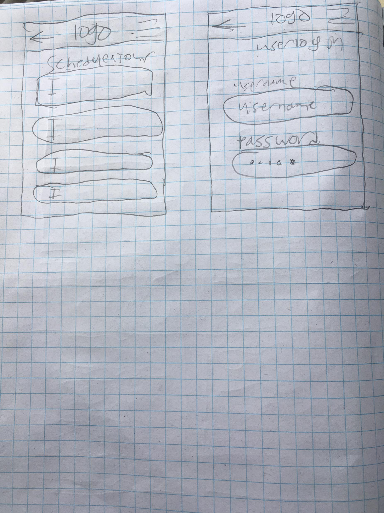
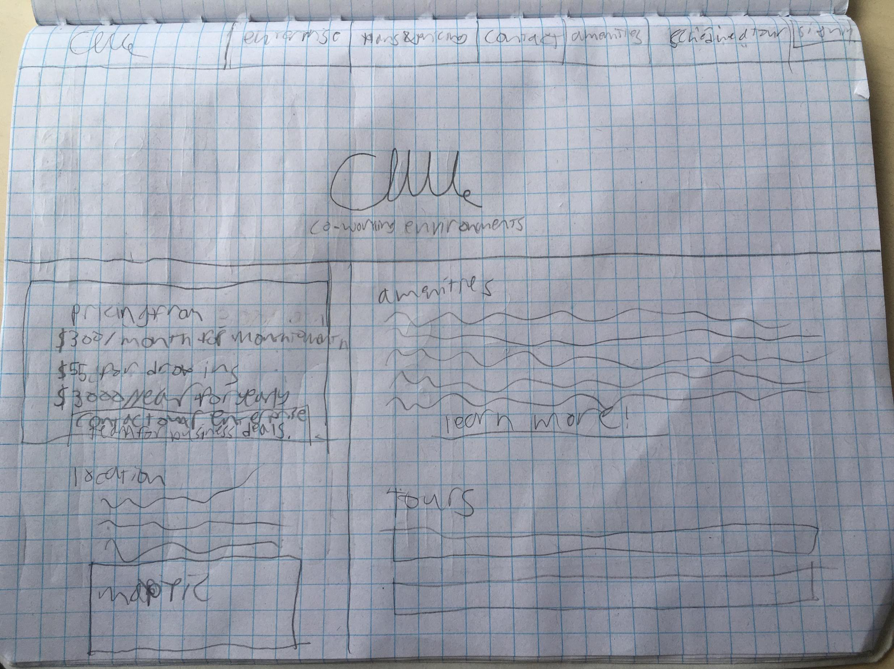
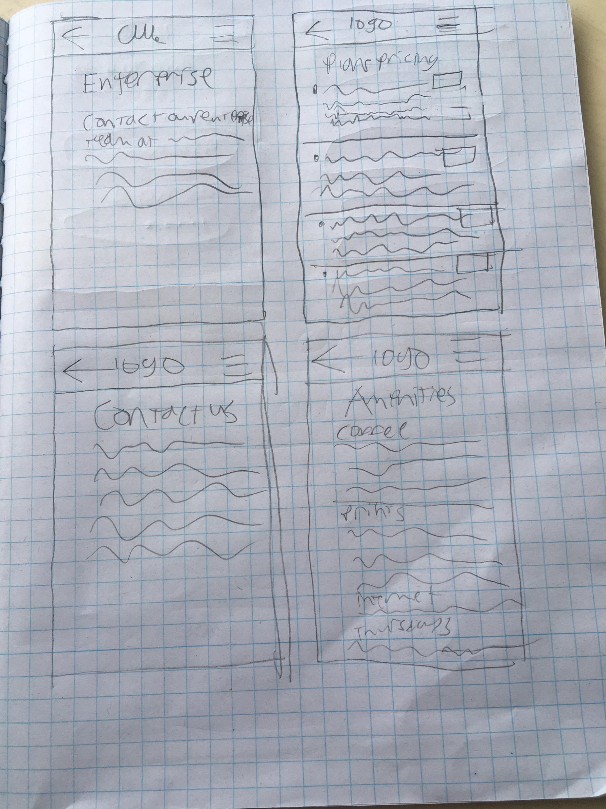
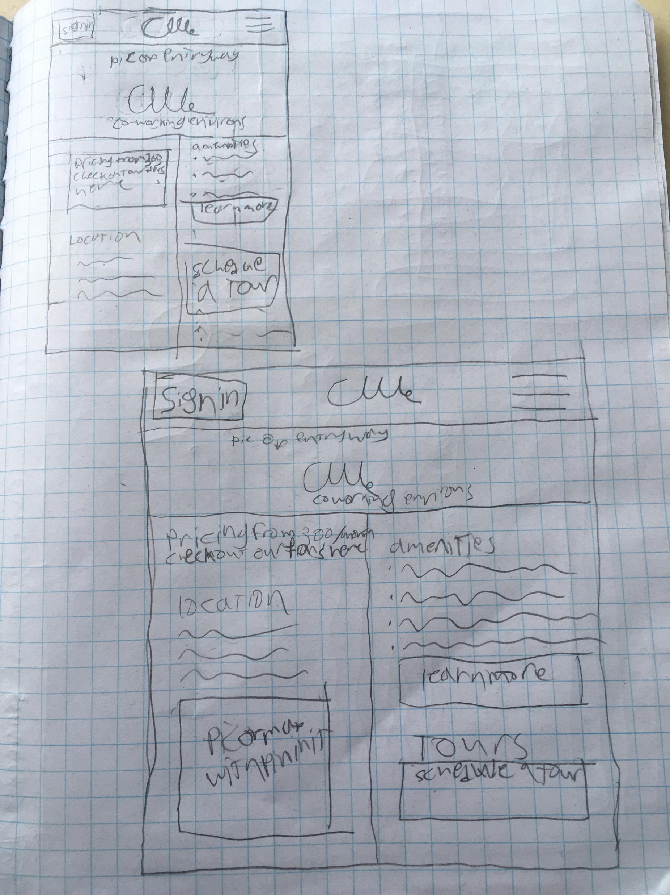
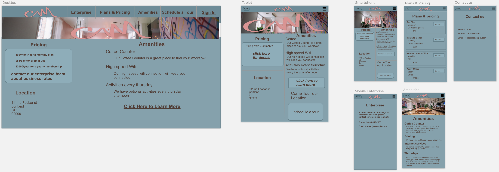
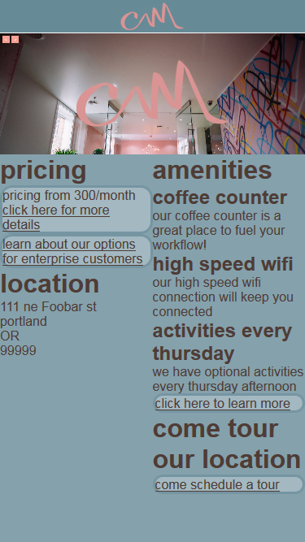

# _co-work website_

## _this is a design of the mobile version of the website of a fictitious co-working start up_

## _installation_
* use the following command line commands
  ```
  git clone https://github.com/CGosser/friday-6.git
  cd fakepath/friday-6
  npm install
  npm run start
  ```

#### _user stories:_
* Alexi Fedor
  * I'm looking for a place to get work done without the distractions of home
  * needs: I need to know basic info like hours of operation and pricing, I'd also like to pay online.
  * pain points: I'm liable to just not bother if it's too hard to find the elements of the site I want to access.

* Andrew Bedor
  * This is an exciting space to work on my designs
  * needs: I really want to know more about the coffee counter, also keeping track of what optional events there are on Thursdays is a must.
  * pain points: I don't like to read a whole paragraph just to get to a single piece of information.

* Gretia Forthrast
  * I need a place to really crack down on work.
  * needs: I really need to make sure this is the right place for me, I'm researching my options before trying anything.
  * pain points: I'm not really a tech person, I'd rather avoid too much of that sort of thing, so I'd really just rather find the phone number and call with my questions.

#### _research and conclusions:_
 pricing tends to be about 295/month for co working, and dedicated desks tend
 to run around 500/month
 the best websites seem to belong to [wework]( https://www.wework.com/l/portland--OR?utm_campaign=1412043062&utm_term=57408665722&utm_content=273341533136&utm_source=ads-google&utm_medium=cpc&gclid=EAIaIQobChMI4c3novO63QIVUWB-Ch2Iewh_EAAYASAAEgKmmvD_BwE&gclsrc=aw.ds), [CoLab](https://colab.one/?gclid=EAIaIQobChMI1ZXpnPC63QIVBdVkCh3-jA9kEAAYASAAEgK0kfD_BwE), and [CENTRL](https://centrloffice.com/) which seem to display a lot of relevant info on the front page, while also keeping with the theme they seem to have going in their workspaces.  From these I've determined that the important thin gs needed to keep with the clients desires are to make sure that the color scheme from the photos displayed on the page and the fonts resemble or compliment the aesthetics of the provided photos. Also make sure to keep in mind that they want something that seems "luxurious"

##### _sections:_
* landing page
* plans and pricing
* contact us
* amenities
* user page
* schedule a tour
* enterprise

#### _sketches:_






#### _page pictures_
##### sketch wireframes


##### page as it currently looks


